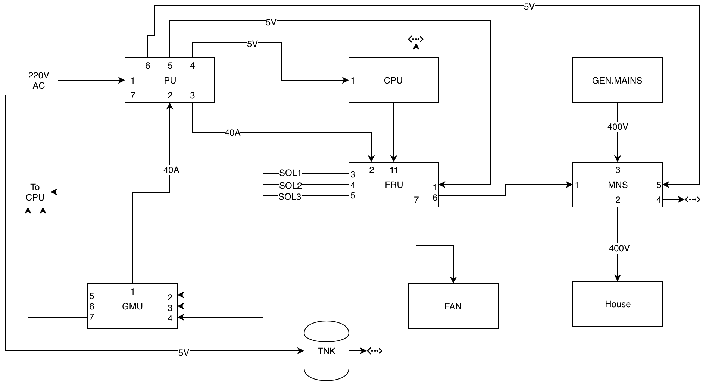
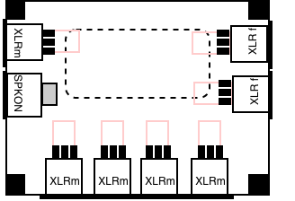
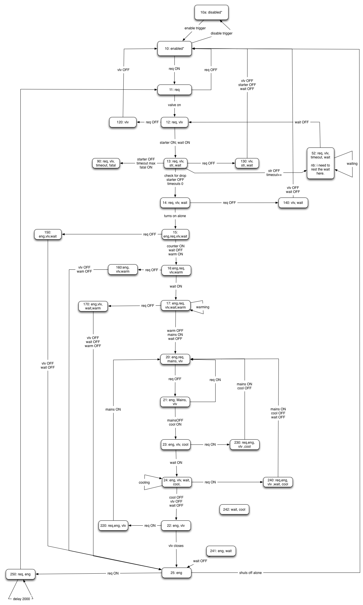

Automatic Start Generator Controller

Automatic Start Generator Controller

Exported on 2022-02-15

 Table of Contents
=================

1 Search this documentation 32 Popular Topics 43 Featured Pages 54
Recently Updated Pages 65 Requirements 75.1 ASGECO Use Cases 75.2 Eyota
Use Cases 115.2.1 100 Network Use Cases 115.2.2 200 Operation Use Cases
125.2.3 300 Control Use Cases 146 Design 176.1 Wireframe for Eyota UI
176.2 ASGECO Eyota Sketch 176.3 Connectors 186.4 Generator Module Unit
(GMU) 196.4.1 Overview 196.4.2 Details 196.5 Controller Module Design
206.5.1 Overview 206.5.2 Controller Module User Interface 206.6 FuseBox
Relays Unit (FRU) 216.6.1 Parts List 226.6.2 Ports 226.6.3 Description
226.7 Power Unit (PU) 236.7.1 Parts List 236.7.2 Ports 246.8 Central
Processing Unit (CPU) 256.8.1 Parts List 256.8.2 Ports 266.8.3 MODBUS
Specifications 267 Implementation 307.1 Implementation: Generator Module
307.1.1 Generator Module Hardware Implementation 307.1.2 Generator
Module Software Implementation 347.2 MODBUS 468 Testing 479 How-to
articles 48

Search this documentation
=========================

Search

Popular Topics
==============

-   [use-case](https://confluence.ortocomputer.com/label/ASGECO/use-case)

-   [arduino](https://confluence.ortocomputer.com/label/ASGECO/arduino)

-   [kb-how-to-article](https://confluence.ortocomputer.com/label/ASGECO/kb-how-to-article)

-   [dev](https://confluence.ortocomputer.com/label/ASGECO/dev)

-   [documentation-space-sample](https://confluence.ortocomputer.com/label/ASGECO/documentation-space-sample)

-   [featured](https://confluence.ortocomputer.com/label/ASGECO/featured)

Featured Pages
==============

-   Page:[Making a
    template](https://confluence.ortocomputer.com/display/ASGECO/Making+a+template)

Recently Updated Pages
======================

-   [Implementation: Generator
    Module](#implementation-generator-module)2019-07-10 • updated
    by [Toni
    Magni](https://confluence.ortocomputer.com/display/~afm) •
    [view
    change](https://confluence.ortocomputer.com/pages/diffpagesbyversion.action?pageId=43679903&selectedPageVersions=1&selectedPageVersions=2)

-   [FuseBox Relays Unit
    (FRU)](#fusebox-relays-unit-fru)2017-12-10 • updated by
    [Toni
    Magni](https://confluence.ortocomputer.com/display/~afm) •
    [view
    change](https://confluence.ortocomputer.com/pages/diffpagesbyversion.action?pageId=67830661&selectedPageVersions=6&selectedPageVersions=7)

-   [Power Unit
    (PU)](#power-unit-pu)2017-12-10 • updated by [Toni
    Magni](https://confluence.ortocomputer.com/display/~afm) •
    [view
    change](https://confluence.ortocomputer.com/pages/diffpagesbyversion.action?pageId=67830859&selectedPageVersions=7&selectedPageVersions=8)

-   [Central Processing Unit
    (CPU)](#central-processing-unit-cpu)2017-12-09 • updated by
    [Toni
    Magni](https://confluence.ortocomputer.com/display/~afm) •
    [view
    change](https://confluence.ortocomputer.com/pages/diffpagesbyversion.action?pageId=67830884&selectedPageVersions=2&selectedPageVersions=3)

-   [Generator Module Unit
    (GMU)](#generator-module-unit-gmu)2017-12-09 • updated by
    [Toni
    Magni](https://confluence.ortocomputer.com/display/~afm) •
    [view
    change](https://confluence.ortocomputer.com/pages/diffpagesbyversion.action?pageId=43679893&selectedPageVersions=6&selectedPageVersions=7)

Requirements
============

-   [ASGECO Use Cases](#asgeco-use-cases)

-   [Eyota Use Cases](#eyota-use-cases)

    1.  ASGECO Use Cases
        ----------------

 This is a list of situations, ASGECO will find itself in. It needs to
be able to handle all of them. This content should be used to test each
release.

<table>
<thead>
<tr class="header">
<th><strong>#</strong></th>
<th><strong>section</strong></th>
<th><strong>description</strong></th>
<th><strong>notes</strong></th>
<th><strong>status</strong></th>
</tr>
</thead>
<tbody>
<tr class="odd">
<td>110</td>
<td>NETWORK</td>
<td><ol type="1">
<li><blockquote>

Network is down

</blockquote>
<ol type="a">
<li><blockquote>

cable unplugged

</blockquote></li>
<li><blockquote>

switch off

</blockquote></li>
<li><blockquote>

link OK, but no one on the net, no gateway

</blockquote></li>
</ol></li>
<li><blockquote>

System is turned on

</blockquote></li>
<li><blockquote>

Network comes back up 

</blockquote>
<ol type="a">
<li><blockquote>

during engine running 

</blockquote></li>
<li><blockquote>

during engine stopped

</blockquote></li>
<li><blockquote>

during engine starting up

</blockquote></li>
<li><blockquote>

during engine shut down

</blockquote></li>
</ol></li>
</ol></td>
<td>System should operate without any majorly noticeable slowdowns during described situations.</td>
<td> </td>
</tr>
<tr class="even">
<td>111</td>
<td>NETWORK</td>
<td><ol type="1">
<li><blockquote>

System is on

</blockquote></li>
<li><blockquote>

Network goes down

</blockquote>
<ol type="a">
<li><blockquote>

cable unplugged

</blockquote></li>
<li><blockquote>

switch off

</blockquote></li>
<li><blockquote>

link OK, but no one on the net, no gateway

</blockquote></li>
</ol></li>
<li><blockquote>

Network comes back up 

</blockquote>
<ol type="a">
<li><blockquote>

during engine running 

</blockquote></li>
<li><blockquote>

during engine stopped

</blockquote></li>
<li><blockquote>

during engine starting up

</blockquote></li>
<li><blockquote>

during engine shut down

</blockquote></li>
</ol></li>
</ol></td>
<td>System should operate without any majorly noticeable slowdowns during described situations.</td>
<td> </td>
</tr>
<tr class="odd">
<td>210</td>
<td>OPERATION</td>
<td><ol type="1">
<li><blockquote>

System is mode:

</blockquote>
<ol type="a">
<li><blockquote>

OFF

</blockquote></li>
<li><blockquote>

AUTO

</blockquote></li>
<li><blockquote>

MANUAL

</blockquote></li>
</ol></li>
<li><blockquote>

A human user manually starts the engine.

</blockquote></li>
<li><blockquote>

A human user eventually stops the engine.

</blockquote></li>
</ol></td>
<td>System should not interfere with human. It should understand it is being overridden and switch to manual mode. System should switch back to automatic mode once the human has switched off the engine.</td>
<td> </td>
</tr>
<tr class="even">
<td>211</td>
<td>OPERATION</td>
<td>
210.1 - 210.2

<ol type="1">
<li><blockquote>

Engine is never manually stopped.

</blockquote></li>
</ol></td>
<td>System should enter emergency state and shut down engine only after a specific very long timeout (say 6 or 12hours). System should stay in manual mode.</td>
<td> </td>
</tr>
<tr class="odd">
<td>213</td>
<td>OPERATION</td>
<td><ol type="1">
<li><blockquote>

System is ON and in whatever state (engine running, engine off, ... doesn't matter)

</blockquote></li>
<li><blockquote>

Power to the system fails temporarily

</blockquote></li>
<li><blockquote>

Upon regaining power, system should return to it's previous state, if still necessary, or stand-by.

</blockquote></li>
</ol></td>
<td>
Power failure can occur for various reasons: system has no fuel, no PV production, backup battery runs out, or maybe while it's running, backup battery charger fails, and backup battery dies, or while running there is poor connection...

System needs to save it's state to non-volatile memory each time it changes. It also needs to check saved state vs current state at boot up.
</td>
<td> </td>
</tr>
<tr class="even">
<td>220</td>
<td>OPERATION</td>
<td><ol type="1">
<li><blockquote>

Operator needs to perform these basic operations locally, when at the system's site:

</blockquote>
<ol type="a">
<li><blockquote>

Trigger an auto startup.

</blockquote></li>
<li><blockquote>

Trigger an auto shut down

</blockquote></li>
<li><blockquote>

Verify System state through a code

</blockquote></li>
</ol></li>
</ol></td>
<td> </td>
<td> </td>
</tr>
<tr class="odd">
<td>310</td>
<td>CONTROL</td>
<td><ol type="1">
<li><blockquote>

User needs to easily know

</blockquote>
<ol type="a">
<li><blockquote>

How long the engine has been going for.

</blockquote></li>
<li><blockquote>

How much energy the generator has produced.

</blockquote></li>
<li><blockquote>

In what state (AUTO, MANUAL, but also coils, switches, who requested it to start, and such) the system is in.

</blockquote></li>
<li><blockquote>

How much fuel is left.

</blockquote></li>
</ol></li>
</ol></td>
<td>System should be able to report, regardless of what state it's in, in a reasonable amount of time.</td>
<td> </td>
</tr>
<tr class="even">
<td>311</td>
<td>CONTROL</td>
<td><ol type="1">
<li><blockquote>

System is ON, Engine might be on or off

</blockquote></li>
<li><blockquote>

Operator is off-site and suspects fuel level is low. He wants to make sure the system doesn't start if the fuel level is too low.

</blockquote></li>
<li><blockquote>

Operator logs in and checks fuel level remotely

</blockquote></li>
<li><blockquote>

Operator eventually switches system to MANUAL mode.

</blockquote></li>
</ol></td>
<td> </td>
<td> </td>
</tr>
<tr class="odd">
<td>212</td>
<td>OPERATION</td>
<td><ol type="1">
<li><blockquote>

System is ON, engine has started for whatever reason (MANUAL or AUTO).

</blockquote></li>
<li><blockquote>

Engine starts to slow down and turns off due to low fuel.

</blockquote></li>
<li><blockquote>

System reports a "no fuel error", and does not allow starting up again, even if there is a request for it.

</blockquote></li>
<li><blockquote>

Tank is filled up again.

</blockquote></li>
<li><blockquote>

System unlocks itself, and returns to previous state.

</blockquote></li>
</ol></td>
<td> </td>
<td> </td>
</tr>
<tr class="even">
<td>320</td>
<td>CONTROL</td>
<td><ol type="1">
<li><blockquote>

Operator needs to have full control of the system

</blockquote>
<ol type="a">
<li><blockquote>

remotely, but within the premises of the neighborhood (while at home).

</blockquote></li>
<li><blockquote>

off-site from any location in the world, when internet is working.

</blockquote></li>
</ol></li>
</ol></td>
<td> </td>
<td> </td>
</tr>
<tr class="odd">
<td>330</td>
<td>CONTROL</td>
<td><ol type="1">
<li><blockquote>

Operator needs to be able to control (write):

</blockquote>
<ol type="a">
<li><blockquote>

all timers

</blockquote></li>
<li><blockquote>

all scaling parameters

</blockquote></li>
<li><blockquote>

all coils

</blockquote></li>
<li><blockquote>

override system (if there is something that's not working) when it's in AUTO to be able to manually take over full control of all coils.

</blockquote></li>
</ol></li>
<li><blockquote>

Operator needs to have access to (read)

</blockquote>
<ol type="a">
<li><blockquote>

all timers

</blockquote></li>
<li><blockquote>

all scaling parameters

</blockquote></li>
<li><blockquote>

all coils

</blockquote></li>
<li><blockquote>

all switches

</blockquote></li>
<li><blockquote>

have access to all coil

</blockquote></li>
</ol></li>
</ol></td>
<td> </td>
<td> </td>
</tr>
<tr class="even">
<td>331</td>
<td>CONTROL</td>
<td><ol type="1">
<li><blockquote>

Operator first installs system and needs to calibrate scaling parameters and timers.

</blockquote></li>
<li><blockquote>

Operator uses remote control in admin mode to setup these parameters.

</blockquote></li>
<li><blockquote>

Operator exits admin mode and starts system

</blockquote></li>
</ol></td>
<td> </td>
<td> </td>
</tr>
<tr class="odd">
<td>332</td>
<td>CONTROL</td>
<td><ol type="1">
<li><blockquote>

As 331 but operator notices that a parameter needs to be adjusted while system is running.

</blockquote></li>
<li><blockquote>

Operator adjusts a parameter while system is running.

</blockquote></li>
<li><blockquote>

System picks up new setting instantly, and behaves accordingly.

</blockquote></li>
</ol></td>
<td> </td>
<td> </td>
</tr>
<tr class="even">
<td>340</td>
<td>CONTROL</td>
<td><ol type="1">
<li><blockquote>

System has started engine in AUTO mode.

</blockquote></li>
<li><blockquote>

System has failed to shut down engine for some known or unknown condition.

</blockquote></li>
<li><blockquote>

Operator manually and remotely or locally shuts down engine.

</blockquote></li>
<li><blockquote>

Operator reads/saves logs to find out what happened.

</blockquote></li>
</ol></td>
<td> </td>
<td> </td>
</tr>
</tbody>
</table>

Eyota Use Cases
---------------

This is a list of situations, Eyota will find itself in. It needs to be
able to handle all of them. This content should be used to test each
release.

-   [100 Network Use
    Cases](#network-use-cases)

-   [200 Operation Use
    Cases](#operation-use-cases)

-   [300 Control Use
    Cases](#control-use-cases)

    1.  ### 100 Network Use Cases

        1.  #### NET-110 System turned on while network is down.

<table>
<thead>
<tr class="header">
<th><strong>next actions</strong></th>
<th></th>
</tr>
</thead>
<tbody>
<tr class="odd">
<td><strong>status</strong></td>
<td> </td>
</tr>
</tbody>
</table>

##### Description

1.  Network is down

    1.  cable unplugged

    2.  switch off

    3.  link OK, but no one on the net, no gateway

2.  System is turned on

3.  Network comes back up 

    1.  during engine running 

    2.  during engine stopped

    3.  during engine starting up

    4.  during engine shut down

        1.  ##### Notes

It is OK for the system to require the network. However, it is critical
for the system not to enter any unknown or unhanded states for this use
case.

#### NET-111 Network goes down and comes back up while system is operating.

<table>
<thead>
<tr class="header">
<th><strong>next actions</strong></th>
<th></th>
</tr>
</thead>
<tbody>
<tr class="odd">
<td><strong>status</strong></td>
<td>Not Started</td>
</tr>
</tbody>
</table>

##### Description 

1.  System is on

2.  Network goes down

    1.  cable unplugged

    2.  switch off

    3.  link OK, but no one on the net, no gateway

3.  Network comes back up 

    1.  during engine running 

    2.  during engine stopped

    3.  during engine starting up

    4.  during engine shut down

        1.  ##### Notes

It is OK for the system to require the network. However, it is critical
for the system not to enter any unknown or unhanded states for this use
case.

1.  ### 200 Operation Use Cases

    1.  #### Overview

This section contains use cases that have to do with the operation of
the system. 

#### OPR-210 Engine is started by human operator, but never stopped.

<table>
<thead>
<tr class="header">
<th><strong>next actions</strong></th>
<th></th>
</tr>
</thead>
<tbody>
<tr class="odd">
<td><strong>status</strong></td>
<td>Not Started</td>
</tr>
</tbody>
</table>

##### Description

1.  OPR-210.1

2.  OPR-210.2

3.  Engine is never manually stopped.

    1.  ##### Notes

System should enter emergency state and shut down engine only after a
specific *very long* timeout (say 6 or 12hours). The time needs to be
very long, just in case the human wants to let the generator run for a
very long time. 

<table>
<tbody>
<tr class="odd">
<td><blockquote>

It is not clear yet, whether the system should return to automatic mode, stay in manual mode, or return to what it was before human intervention. Today it feels appropriate for the system to go and stay in manual operation mode, if the user interacts with it. It would then be upto the user to enable automatic mode again.

</blockquote></td>
</tr>
</tbody>
</table>

#### OPR-210 Human operator manually starts and stops the system

<table>
<thead>
<tr class="header">
<th><strong>next actions</strong></th>
<th></th>
</tr>
</thead>
<tbody>
<tr class="odd">
<td><strong>status</strong></td>
<td>Not Started</td>
</tr>
</tbody>
</table>

##### Description

1.  System is mode:

    1.  OFF

    2.  AUTO

    3.  MANUAL

2.  A human user manually starts the engine.

3.  A human user eventually stops the engine.

    1.  ##### Notes

The system should never interfere with human, regardless of what mode
it's in. It should understand it is being overridden (and if necessary
switch to manual mode). If necessary, system should switch back to
automatic mode once the human has switched off the engine. 

#### OPR-212 Engine runs out of fuel

<table>
<thead>
<tr class="header">
<th><strong>next actions</strong></th>
<th></th>
</tr>
</thead>
<tbody>
<tr class="odd">
<td><strong>status</strong></td>
<td>Not Started</td>
</tr>
</tbody>
</table>

##### Description

1.  System is ON, engine has started for whatever reason (MANUAL or
    AUTO).

2.  Engine starts to slow down and turns off due to low fuel.

3.  System reports a "no fuel error", and does not allow starting up
    again, even if there is a request for it.

4.  Tank is filled up again.

5.  System unlocks itself, and returns to previous state.

    1.  ##### Notes

    <!-- -->

    1.  #### OPR-213 System reboots during operation

<table>
<thead>
<tr class="header">
<th><strong>next actions</strong></th>
<th></th>
</tr>
</thead>
<tbody>
<tr class="odd">
<td><strong>status</strong></td>
<td>Not Started</td>
</tr>
</tbody>
</table>

##### Description

1.  System is ON and in whatever state (engine running, engine off, ...
    doesn't matter)

2.  Power to the system fails temporarily.

3.  Power returns, and system reboots. 

4.  Upon regaining power, system returns to it's previous state, if
    still necessary, or stand-by, but never forgets the engine on.

    1.  ##### Notes

Power failure can occur for various reasons: system has no fuel, no PV
production, backup battery runs out, or maybe while it's running, backup
battery charger fails, and backup battery dies, or while running there
is poor connection...  
System needs to save it's state to non-volatile memory each time it
changes. It also needs to check saved state vs current state at boot up.
This is necessary in order to prevent the engine to never shut down, if
the system reboots during operation.

#### OPR-220 Normal human operator intervention on site

<table>
<thead>
<tr class="header">
<th><strong>next actions</strong></th>
<th></th>
</tr>
</thead>
<tbody>
<tr class="odd">
<td><strong>status</strong></td>
<td>Not Started</td>
</tr>
</tbody>
</table>

##### Description

1.  Operator needs to perform these basic operations locally, when at
    the system's site:

    1.  Trigger an auto startup.

    2.  Trigger an auto shut down

    3.  Verify System state

        1.  ##### Notes

System state can be verified making use of an interface such as LEDs,
numerical system codes, or display. 

1.  ### 300 Control Use Cases

    1.  #### Overview

Use Cases related to the control of the system. The have to do with the
User Interface (UI).

-   [CTR-310 Operator checks system
    status](#ctr-310-operator-checks-system-status)

-   [CTR-311 Operator changes system mode
    remotely](#ctr-311-operator-changes-system-mode-remotely)

-   [CTR-330 Operators maintenance
    tasks](#ctr-330-operators-maintenance-tasks)

-   [CTR-331 Operator performs initial
    calibration](#ctr-331-operator-performs-initial-calibration)

-   [CTR-332 Operator performs calibrations
    while engine is
    running](#ctr-332-operator-performs-calibrations-while-engine-is-running)

-   [CTR-340 Operator accesses logs if something
    goes
    wrong](#ctr-340-operator-accesses-logs-if-something-goes-wrong)

    1.  #### CTR-310 Operator checks system status

<table>
<thead>
<tr class="header">
<th><strong>next actions</strong></th>
<th></th>
</tr>
</thead>
<tbody>
<tr class="odd">
<td><strong>status</strong></td>
<td>Not Started</td>
</tr>
</tbody>
</table>

##### Description

1.  User needs to easily know

    1.  How long the engine has been going for.

    2.  How much energy the generator has produced.

    3.  In what state (AUTO, MANUAL, but also coils, switches, who
        requested it to start, and such) the system is in.

    4.  How much fuel is left.

        1.  ##### Notes

System should be able to respond in a reasonable amount of
time, regardless of what state it's in. 

#### CTR-311 Operator changes system mode remotely

<table>
<thead>
<tr class="header">
<th><strong>next actions</strong></th>
<th></th>
</tr>
</thead>
<tbody>
<tr class="odd">
<td><strong>status</strong></td>
<td>Not Started</td>
</tr>
</tbody>
</table>

##### Description

1.  System is ON, Engine might be on or off.

2.  Operator is off-site.

3.  Operator logs in and checks system status remotely.

4.  Operator eventually switches system to MANUAL mode.

    1.  ##### Notes

There can be a variety of reasons of why the operator might want to
change system mode remotely. One of them being, simply having forgotten
to enable automatic mode. 

#### CTR-330 Operators maintenance tasks

<table>
<thead>
<tr class="header">
<th><strong>next actions</strong></th>
<th></th>
</tr>
</thead>
<tbody>
<tr class="odd">
<td><strong>status</strong></td>
<td>Not Started</td>
</tr>
</tbody>
</table>

##### Description

During regular maintenance and control, the following is a list of
control that the operator needs to have.

1.  Operator needs to be able to control (write):

    1.  all timers

    2.  all scaling parameters

    3.  all coils

    4.  override system (if there is something that's not working) when
        it's in AUTO to be able to manually take over full control of
        all coils.

2.  Operator needs to have access to (read)

    1.  all timers

    2.  all scaling parameters

    3.  all coils

    4.  all switches

    5.  have access to all coil

        1.  ##### Notes

        <!-- -->

        1.  #### CTR-331 Operator performs initial calibration

<table>
<thead>
<tr class="header">
<th><strong>next actions</strong></th>
<th></th>
</tr>
</thead>
<tbody>
<tr class="odd">
<td><strong>status</strong></td>
<td>Not Started</td>
</tr>
</tbody>
</table>

##### Description

1.  Operator first installs system and needs to calibrate scaling
    parameters and timers.

2.  Operator uses remote control in admin mode to setup these
    parameters.

3.  Operator exits admin mode and starts system

    1.  ##### Notes

    <!-- -->

    1.  #### CTR-332 Operator performs calibrations while engine is running

<table>
<thead>
<tr class="header">
<th><strong>next actions</strong></th>
<th></th>
</tr>
</thead>
<tbody>
<tr class="odd">
<td><strong>status</strong></td>
<td>Not Started</td>
</tr>
</tbody>
</table>

##### Description

1.  Same as [CTR-331 Operator performs initial
    calibration](#ctr-331-operator-performs-initial-calibration) but
    operator notices that a parameter needs to be adjusted while system
    is running.

2.  Operator adjusts a parameter while system is running.

3.  System picks up new setting instantly, and behaves accordingly.

    1.  ##### Notes

    <!-- -->

    1.  #### CTR-340 Operator accesses logs if something goes wrong

<table>
<thead>
<tr class="header">
<th><strong>next actions</strong></th>
<th></th>
</tr>
</thead>
<tbody>
<tr class="odd">
<td><strong>status</strong></td>
<td>Not Started</td>
</tr>
</tbody>
</table>

##### Description

1.  System has started engine in AUTO mode.

2.  System has failed to shut down engine for some known or unknown
    condition.

3.  Operator manually remotely or locally shuts down engine.

4.  Operator reads/saves logs to find out what happened.

    1.  ##### Notes

Ideally, the system has to always be able to let the operator take over.
If some part of the system crashes, and this is not possible, then there
should be logs available to help debug the situation. 

1.  Design
    ======

    1.  Wireframe for Eyota UI
        ----------------------

Wireframe currently hosted on Cacoo: [https://cacoo.com/diagrams/tuTflMT94yfAUYTl\#](https://cacoo.com/diagrams/tuTflMT94yfAUYTl)

ASGECO Eyota Sketch
-------------------

-   [version
    1](https://confluence.ortocomputer.com/download/attachments/10223652/2014_04_19_22_17_54.pdf?api=v2&modificationDate=1397946038306&version=1) 

-   [version
    2](https://confluence.ortocomputer.com/download/attachments/10223652/eyota General Diagram.png?api=v2&modificationDate=1413413971864&version=1)

-   [version
    3](https://confluence.ortocomputer.com/download/attachments/10223652/Asgeco eyota Diagram.png?api=v2&modificationDate=1485360793240&version=1)

<!-- -->

-   [Generator Module Unit
    (GMU)](#generator-module-unit-gmu)

-   [Controller Module
    Design](#controller-module-design)

-   [FuseBox Relays Unit
    (FRU)](#fusebox-relays-unit-fru)

-   [Power Unit (PU)](#power-unit-pu)

-   [Central Processing Unit
    (CPU)](#central-processing-unit-cpu)

PU: Power Unit

GEN: Generator Unit

FRU: Fuse Relays Unit

MNS: Mains Unit

FAN: Fan

CPU: Central Processing Unit

Connectors
----------

<table>
<thead>
<tr class="header">
<th><strong>port</strong></th>
<th><strong>type</strong></th>
<th><strong>gender</strong></th>
</tr>
</thead>
<tbody>
<tr class="odd">
<td>PU.1</td>
<td>C13 Socket</td>
<td>f</td>
</tr>
<tr class="even">
<td>PU.2</td>
<td>Speakon</td>
<td> </td>
</tr>
<tr class="odd">
<td>PU.3</td>
<td>Speakon</td>
<td> </td>
</tr>
<tr class="even">
<td>PU.4-8</td>
<td>XLR 5V out</td>
<td>f</td>
</tr>
<tr class="odd">
<td>TNK.1</td>
<td>XLR</td>
<td>m</td>
</tr>
<tr class="even">
<td>TNK.2</td>
<td>RJ45</td>
<td>f</td>
</tr>
</tbody>
</table>

<table>
<thead>
<tr class="header">
<th><strong>port</strong></th>
<th><strong>type</strong></th>
<th><strong>gender</strong></th>
</tr>
</thead>
<tbody>
<tr class="odd">
<td>MNS.1</td>
<td>XLR</td>
<td>m</td>
</tr>
<tr class="even">
<td>MNS.2</td>
<td>400V</td>
<td>f</td>
</tr>
<tr class="odd">
<td>MNS.3</td>
<td>400V</td>
<td>m</td>
</tr>
<tr class="even">
<td>MNS.4</td>
<td>RJ45</td>
<td>f</td>
</tr>
<tr class="odd">
<td>GMU.1</td>
<td>Speakon</td>
<td> </td>
</tr>
<tr class="even">
<td>GMU.2-4</td>
<td>XLR</td>
<td>m</td>
</tr>
<tr class="odd">
<td>GMU.5-6</td>
<td>XLR</td>
<td>f</td>
</tr>
<tr class="even">
<td>GMU.7</td>
<td>XLR</td>
<td>m</td>
</tr>
</tbody>
</table>

<table>
<thead>
<tr class="header">
<th><strong>File</strong></th>
<th><strong>Modified</strong></th>
</tr>
</thead>
<tbody>
<tr class="odd">
<td>PDF File <a href="https://confluence.ortocomputer.com/download/attachments/10223652/2014_04_19_22_17_54.pdf?api=v2">2014_04_19_22_17_54.pdf</a></td>
<td>2014-04-20 by <a href="https://confluence.ortocomputer.com/display/~afm">Toni Magni</a></td>
</tr>
<tr class="even">
<td>PNG File <a href="https://confluence.ortocomputer.com/download/attachments/10223652/eyota General Diagram.png?api=v2">eyota General Diagram.png</a></td>
<td>2014-10-16 by <a href="https://confluence.ortocomputer.com/display/~afm">Toni Magni</a></td>
</tr>
<tr class="odd">
<td>ZIP Archive <a href="https://confluence.ortocomputer.com/download/attachments/10223652/eyota General Diagram.graffle.zip?api=v2">eyota General Diagram.graffle.zip</a></td>
<td>2014-10-16 by <a href="https://confluence.ortocomputer.com/display/~afm">Toni Magni</a></td>
</tr>
<tr class="even">
<td>PNG File <a href="https://confluence.ortocomputer.com/download/attachments/10223652/Asgeco eyota Diagram.png?api=v2">Asgeco eyota Diagram.png</a></td>
<td>2017-01-25 by <a href="https://confluence.ortocomputer.com/display/~afm">Toni Magni</a></td>
</tr>
<tr class="odd">
<td>XML File <a href="https://confluence.ortocomputer.com/download/attachments/10223652/Asgeco Overall Diagram.xml?api=v2">Asgeco Overall Diagram.xml</a></td>
<td>2017-01-25 by <a href="https://confluence.ortocomputer.com/display/~afm">Toni Magni</a></td>
</tr>
<tr class="even">
<td>File <a href="https://confluence.ortocomputer.com/download/attachments/10223652/Asgeco Overall Diagram?api=v2">Asgeco Overall Diagram</a> Draw.io diagram</td>
<td>2017-12-09 by <a href="https://confluence.ortocomputer.com/display/~afm">Toni Magni</a></td>
</tr>
<tr class="odd">
<td>PNG File <a href="https://confluence.ortocomputer.com/download/attachments/10223652/Asgeco Overall Diagram.png?api=v2">Asgeco Overall Diagram.png</a> Asgeco Overall Diagram exported to image</td>
<td>2017-12-09 by <a href="https://confluence.ortocomputer.com/display/~afm">Toni Magni</a></td>
</tr>
</tbody>
</table>

1.  Generator Module Unit (GMU)
    ---------------------------

    1.  ### Overview

-   Is connected to the generator's coils and sensors.

-   Provides high level functions over Modbus TCP (Ethernet) like:

    -   Turn Engine on or off

    -   Turn Mains coil on or off

    -   Read various statuses, like oil pressure, engine state, coil
        state.

        1.  ### Details

#### MODBUS Specifications

Controller Module Design
------------------------

-   [Controller Module User
    Interface](#controller-module-user-interface)

    1.  ### Overview

<!-- -->

-   This module serves to decide when to run the generator. 

-   It can take various inputs into consideration, and control more than
    just the generator, if necessary.

-   It probably needs to be run on a more performant system, like a
    Rasberry PI, or better. Arduino UNO or Duemilanove is not
    recommended. 

    1.  ### Controller Module User Interface

<!-- -->

-   [Asgeco remote control
    URLs](#asgeco-remote-control-urls)

    1.  #### Asgeco remote control URLs

        1.  ##### Panoramica

Centralina di avviamento e spegnimento automatico generatore.

##### Come usare

1.  Accertarsi che la chiavetta di avviamento sul generatore sia sulla
    posizione acceso.

2.  Accertarsi che il magento-termico sul generatore sia sulla posizione
    acceso.

3.  Accertarsi che il connettore 8P8C e il connettore multipolare sotto
    il cassone sia inserito bene. A volte tende a sfilarsi.

4.  Accendere asgeco.

5.  Attivare parametro 17 AUTO su asgeco. Quando AUTO è disabilitato,
    tutta il software di gestione autonoma è disabilitato.

    1.  ##### Comandi

<table>
<thead>
<tr class="header">
<th><strong>MODE</strong></th>
<th><strong> </strong></th>
<th><strong>ENGINE</strong></th>
<th><strong> </strong></th>
<th><strong>SYSTEM</strong></th>
<th><strong> </strong></th>
<th><strong>MAINS</strong></th>
<th><strong> </strong></th>
<th></th>
<th></th>
<th></th>
</tr>
</thead>
<tbody>
<tr class="odd">
<td><a href="http://asgeco.ciapee.lan.afm.co/?ASGECOv2&amp;14=0">MANU</a></td>
<td><a href="http://asgeco.ciapee.lan.afm.co/?ASGECOv2&amp;14=1">AUTO</a></td>
<td> </td>
<td><a href="http://asgeco.ciapee.lan.afm.co/?ASGECOv2&amp;14=0&amp;6=1">START</a></td>
<td><a href="http://asgeco.ciapee.lan.afm.co/?ASGECOv2&amp;14=0&amp;6=0">STOP</a></td>
<td> </td>
<td><a href="http://asgeco.ciapee.lan.afm.co/?ASGECOv2&amp;31=1">REBOOT</a></td>
<td> </td>
<td><a href="http://ciapee.dyndns.org:2727/?ASGECOv2&amp;5=1">ON</a></td>
<td><a href="http://ciapee.dyndns.org:2727/?ASGECOv2&amp;5=0">OFF</a></td>
<td> </td>
</tr>
</tbody>
</table>

FuseBox Relays Unit (FRU)
-------------------------

<table>
<tbody>
<tr class="odd">
<td><ul>
<li><blockquote>

It wouldn't be bad to have one of the outputs be 220V AC for the AC fan. Which means we need a C16 AC port on this unit as well.

</blockquote></li>
</ul></td>
</tr>
</tbody>
</table>

### Parts List

<table>
<thead>
<tr class="header">
<th><strong>what</strong></th>
<th><strong>qty</strong></th>
<th><strong>notes</strong></th>
<th><strong>EUR</strong></th>
</tr>
</thead>
<tbody>
<tr class="odd">
<td>DB15 connector</td>
<td>1</td>
<td> </td>
<td> </td>
</tr>
<tr class="even">
<td>XLR f</td>
<td>8</td>
<td> </td>
<td> </td>
</tr>
<tr class="odd">
<td>XLR m</td>
<td>1</td>
<td> </td>
<td> </td>
</tr>
<tr class="even">
<td>Speakon</td>
<td>1</td>
<td> </td>
<td> </td>
</tr>
<tr class="odd">
<td>8CH Relay board</td>
<td>1</td>
<td> </td>
<td> </td>
</tr>
<tr class="even">
<td>Fuse Box 8CH</td>
<td>1</td>
<td> </td>
<td> </td>
</tr>
<tr class="odd">
<td>10A fuses</td>
<td>8</td>
<td> </td>
<td> </td>
</tr>
<tr class="even">
<td>Case</td>
<td>1</td>
<td> </td>
<td> </td>
</tr>
</tbody>
</table>

### Ports

<table>
<thead>
<tr class="header">
<th><strong>FRU1</strong></th>
<th>5V 500mA power input</th>
<th> </th>
</tr>
</thead>
<tbody>
<tr class="odd">
<td><strong>FRU2</strong></td>
<td>12V 80A from GEN battery</td>
<td> </td>
</tr>
<tr class="even">
<td><strong>FRU3</strong></td>
<td>Relay output CH1</td>
<td>12V +/-</td>
</tr>
<tr class="odd">
<td><strong>FRU4</strong></td>
<td>Relay output CH2</td>
<td>12V +/-</td>
</tr>
<tr class="even">
<td><strong>FRU5</strong></td>
<td>Relay output CH3</td>
<td>12V +/-</td>
</tr>
<tr class="odd">
<td><strong>FRU6</strong></td>
<td>Relay output CH4</td>
<td>12V +/-</td>
</tr>
<tr class="even">
<td><strong>FRU7</strong></td>
<td>Relay output CH5</td>
<td>Straight to relay, for fan or other uses.</td>
</tr>
<tr class="odd">
<td><strong>FRU8</strong></td>
<td>Relay output CH6</td>
<td> </td>
</tr>
<tr class="even">
<td><strong>FRU9</strong></td>
<td>Relay output CH7</td>
<td> </td>
</tr>
<tr class="odd">
<td><strong>FRU10</strong></td>
<td>Relay output CH8</td>
<td> </td>
</tr>
<tr class="even">
<td><strong>FRU11</strong></td>
<td>control data from CPU</td>
<td> </td>
</tr>
</tbody>
</table>

### Description

-   This module is designed to be re-usable for other project. It should
    be built in such a way to be easily re-wirable for other projects.

-   At least 3 output ports should be wired to provide 12V DC straight
    to the XLR connector, s.t. they can power the solenoids directly. 

-   At least 1 or 2 output ports should be wired directly (via fuse)
    through the relay, s.t. they can be used as switches, for example to
    turn the fan on or off. 

<table>
<thead>
<tr class="header">
<th><strong>File</strong></th>
<th><strong>Modified</strong></th>
</tr>
</thead>
<tbody>
<tr class="odd">
<td>File <a href="https://confluence.ortocomputer.com/download/attachments/67830661/ASGECO Fusebox Relay Unit?api=v2">ASGECO Fusebox Relay Unit</a> Draw.io diagram</td>
<td>2017-12-10 by <a href="https://confluence.ortocomputer.com/display/~afm">Toni Magni</a></td>
</tr>
<tr class="even">
<td>PNG File <a href="https://confluence.ortocomputer.com/download/attachments/67830661/ASGECO Fusebox Relay Unit.png?api=v2">ASGECO Fusebox Relay Unit.png</a> ASGECO Fusebox Relay Unit exported to image</td>
<td>2017-12-10 by <a href="https://confluence.ortocomputer.com/display/~afm">Toni Magni</a></td>
</tr>
</tbody>
</table>

Power Unit (PU)
---------------

### Parts List

<table>
<thead>
<tr class="header">
<th><strong>item</strong></th>
<th><strong>qty</strong></th>
<th><strong> </strong></th>
<th><strong>EUR</strong></th>
</tr>
</thead>
<tbody>
<tr class="odd">
<td>fuse holder</td>
<td>4</td>
<td> </td>
<td> </td>
</tr>
<tr class="even">
<td>fuses</td>
<td>4</td>
<td> </td>
<td> </td>
</tr>
<tr class="odd">
<td>XLR f</td>
<td>5-12</td>
<td> </td>
<td>19</td>
</tr>
<tr class="even">
<td>Speakon panel</td>
<td>2</td>
<td><a href="http://www.ebay.it/itm/Connettore-Spina-da-pannello-Speakon-4-poli-in-plastica-a-flangia-quadrata-/221052663218?hash=item3377c3f5b2:g:SA0AAOSwLN5WkAEg">http://www.ebay.it/itm/Connettore-Spina-da-pannello-Speakon-4-poli-in-plastica-a-flangia-quadrata-/221052663218?hash=item3377c3f5b2:g:SA0AAOSwLN5WkAEg</a></td>
<td>8</td>
</tr>
<tr class="odd">
<td>12V 7Ah battery</td>
<td>1</td>
<td><a href="http://www.ebay.it/sch/i.html?_from=R40&amp;_trksid=p2050601.m570.l1311.R3.TR11.TRC1.A0.H1.Xbatteria+12V+.TRS0&amp;_nkw=batteria+12v+7ah&amp;_sacat=0">http://www.ebay.it/sch/i.html?_from=R40&amp;_trksid=p2050601.m570.l1311.R3.TR11.TRC1.A0.H1.Xbatteria+12V+.TRS0&amp;_nkw=batteria+12v+7ah&amp;_sacat=0</a></td>
<td>15</td>
</tr>
<tr class="even">
<td>case</td>
<td>1</td>
<td>Usa Elkron in FU11.A1</td>
<td> </td>
</tr>
<tr class="odd">
<td>
C13 female power

connector
</td>
<td>1</td>
<td> </td>
<td>8</td>
</tr>
<tr class="even">
<td>DC-DC 12V-5V 3A</td>
<td>2</td>
<td>In FU11.A2.Alimentazione</td>
<td> </td>
</tr>
<tr class="odd">
<td>220V-12V 2.5A Power Supply</td>
<td>1</td>
<td>
<em>Why do i Need this?? 12V Power Will Come From 7Ah Battery.</em>

<a href="http://www.ebay.it/itm/Alimentatore-Switching-12V-24V-DC-60W-150W-250W-Industrial-ULTRA-SLIM-/112020224171?var=&amp;hash=item1a14ecf8ab:m:mWfOMhDfYoRhQG9EHn2m7UQ">http://www.ebay.it/itm/Alimentatore-Switching-12V-24V-DC-60W-150W-250W-Industrial-ULTRA-SLIM-/112020224171?var=&amp;hash=item1a14ecf8ab:m:mWfOMhDfYoRhQG9EHn2m7UQ</a>
</td>
<td>20</td>
</tr>
<tr class="even">
<td>Charger for Starter battery</td>
<td>1</td>
<td>Usa C-Tek</td>
<td> </td>
</tr>
<tr class="odd">
<td>Charger for backup</td>
<td>1</td>
<td>Usa Elkron in FU11.A1</td>
<td> </td>
</tr>
</tbody>
</table>

### Ports

<table>
<thead>
<tr class="header">
<th> </th>
<th> </th>
</tr>
</thead>
<tbody>
<tr class="odd">
<td>PU1</td>
<td>AC Power input. 220V AC</td>
</tr>
<tr class="even">
<td>PU2</td>
<td>Generator Battery</td>
</tr>
<tr class="odd">
<td>PU3</td>
<td>Generator Battery Passthrough</td>
</tr>
<tr class="even">
<td>PU4</td>
<td>12V + 5V output port 1 (total max 6A for all ports)</td>
</tr>
<tr class="odd">
<td>PU5</td>
<td>12V + 5V output port 2 (total max 6A for all ports)</td>
</tr>
<tr class="even">
<td>PU6</td>
<td>12V + 5V output port 3 (total max 6A for all ports)</td>
</tr>
<tr class="odd">
<td>PU7</td>
<td>12V + 5V output port 4 (total max 6A for all ports)</td>
</tr>
<tr class="even">
<td>PU8</td>
<td>12V + 5V output port 5 (total max 6A for all ports)</td>
</tr>
<tr class="odd">
<td><blockquote>

<strong>XLR Power Output Ports</strong>

The power output ports will use 3 pin XLR connectors: 1pin for ground, 1pin for 5V 1 pin for 12V.

</blockquote></td>
<td></td>
</tr>
</tbody>
</table>

<table>
<thead>
<tr class="header">
<th><strong>File</strong></th>
<th><strong>Modified</strong></th>
</tr>
</thead>
<tbody>
<tr class="odd">
<td>PNG File <a href="https://confluence.ortocomputer.com/download/attachments/67830859/PU_PowerUnit.png?api=v2">PU_PowerUnit.png</a></td>
<td>2017-01-10 by <a href="https://confluence.ortocomputer.com/display/~afm">Toni Magni</a></td>
</tr>
<tr class="even">
<td>XML File <a href="https://confluence.ortocomputer.com/download/attachments/67830859/PU_PowerUnit.xml?api=v2">PU_PowerUnit.xml</a></td>
<td>2017-01-10 by <a href="https://confluence.ortocomputer.com/display/~afm">Toni Magni</a></td>
</tr>
</tbody>
</table>

Central Processing Unit (CPU)
-----------------------------

-   [MODBUS
    Specifications](#modbus-specifications-1)

    1.  ### Parts List

<table>
<thead>
<tr class="header">
<th> </th>
<th> </th>
<th> </th>
<th> </th>
</tr>
</thead>
<tbody>
<tr class="odd">
<td> </td>
<td> </td>
<td> </td>
<td> </td>
</tr>
<tr class="even">
<td> </td>
<td> </td>
<td> </td>
<td> </td>
</tr>
<tr class="odd">
<td> </td>
<td> </td>
<td> </td>
<td> </td>
</tr>
<tr class="even">
<td> </td>
<td> </td>
<td> </td>
<td> </td>
</tr>
<tr class="odd">
<td> </td>
<td> </td>
<td> </td>
<td> </td>
</tr>
<tr class="even">
<td> </td>
<td> </td>
<td> </td>
<td> </td>
</tr>
<tr class="odd">
<td> </td>
<td> </td>
<td> </td>
<td> </td>
</tr>
<tr class="even">
<td> </td>
<td> </td>
<td> </td>
<td> </td>
</tr>
</tbody>
</table>

### Ports

<table>
<thead>
<tr class="header">
<th><strong> </strong></th>
<th><strong> </strong></th>
</tr>
</thead>
<tbody>
<tr class="odd">
<td>CPU1</td>
<td> </td>
</tr>
<tr class="even">
<td>CPU2</td>
<td> </td>
</tr>
<tr class="odd">
<td>CPU3</td>
<td> </td>
</tr>
<tr class="even">
<td>CPU4</td>
<td> </td>
</tr>
<tr class="odd">
<td>CPU5</td>
<td> </td>
</tr>
</tbody>
</table>

<table>
<thead>
<tr class="header">
<th><strong>File</strong></th>
<th><strong>Modified</strong></th>
</tr>
</thead>
<tbody>
<tr class="odd">
<td>XML File <a href="https://confluence.ortocomputer.com/download/attachments/67830884/ASGECO CPU.xml?api=v2">ASGECO CPU.xml</a></td>
<td>2017-01-11 by <a href="https://confluence.ortocomputer.com/display/~afm">Toni Magni</a></td>
</tr>
<tr class="even">
<td>File <a href="https://confluence.ortocomputer.com/download/attachments/67830884/ASGECO CPU?api=v2">ASGECO CPU</a> Draw.io diagram</td>
<td>2017-12-09 by <a href="https://confluence.ortocomputer.com/display/~afm">Toni Magni</a></td>
</tr>
<tr class="odd">
<td>PNG File <a href="https://confluence.ortocomputer.com/download/attachments/67830884/ASGECO CPU.png?api=v2">ASGECO CPU.png</a> ASGECO CPU exported to image</td>
<td>2017-12-09 by <a href="https://confluence.ortocomputer.com/display/~afm">Toni Magni</a></td>
</tr>
</tbody>
</table>

1.  ### MODBUS Specifications

    1.  #### SUPPORTED MODBUS FUNCTIONS

-   MB\_FC\_READ\_COILS = 1,

-   MB\_FC\_READ\_DISCRETE\_INPUT = 2,

-   MB\_FC\_READ\_REGISTERS = 3,

-   MB\_FC\_READ\_INPUT\_REGISTER = 4

-   MB\_FC\_WRITE\_COIL = 5

-   MB\_FC\_WRITE\_REGISTER = 6

-   MB\_FC\_WRITE\_MULTIPLE\_COILS = 15

-   MB\_FC\_WRITE\_MULTIPLE\_REGISTERS = 16

    1.  #### READ HOLDING REGISTERS (0X03) AND READ INPUT REGISTERS (0X04)

        1.  ##### RAM

<table>
<thead>
<tr class="header">
<th><strong>Logical Addr</strong></th>
<th><strong>Variable name</strong></th>
<th><strong>Variable description</strong></th>
<th><strong>Unit s</strong></th>
<th><strong>Range</strong></th>
<th><strong>Description</strong></th>
</tr>
</thead>
<tbody>
<tr class="odd">
<td>1</td>
<td>ard_volts</td>
<td>Arduino CPU voltage</td>
<td>mV</td>
<td> </td>
<td>Voltage of CPU main board</td>
</tr>
<tr class="even">
<td>2</td>
<td>gen_volts</td>
<td>Generator battery voltage</td>
<td>mV</td>
<td> </td>
<td>Voltage of Battery used to start generator</td>
</tr>
<tr class="odd">
<td>3</td>
<td>getCurrentRunningSeconds()</td>
<td>Current running time</td>
<td>s</td>
<td> </td>
<td>Amount of time since last engine startup</td>
</tr>
<tr class="even">
<td>4</td>
<td>getCurrentStoppedSeconds()</td>
<td>Current resting time</td>
<td>s</td>
<td> </td>
<td>Amount of time since last engine shutdown</td>
</tr>
<tr class="odd">
<td>5</td>
<td>getAttempts()</td>
<td>Number of engine starting attempts</td>
<td> </td>
<td>0-5</td>
<td> </td>
</tr>
<tr class="even">
<td>6</td>
<td>starterCurrentPin</td>
<td>Starter current</td>
<td> </td>
<td>0-1024</td>
<td> </td>
</tr>
</tbody>
</table>

##### EEPROM

<table>
<thead>
<tr class="header">
<th><strong>Logical Addr</strong></th>
<th><strong>Variable name</strong></th>
<th><strong>Variable description</strong></th>
<th><strong>Units</strong></th>
<th><strong>rw/ro</strong></th>
<th><strong>Range</strong></th>
<th><strong>Description</strong></th>
</tr>
</thead>
<tbody>
<tr class="odd">
<td>1001</td>
<td>getTotalRunSecs()</td>
<td>Total runtime counter</td>
<td>secs</td>
<td>ro</td>
<td> </td>
<td> </td>
</tr>
<tr class="even">
<td>1002</td>
<td>getVconv()</td>
<td>Conversion factor for generator battery sensor</td>
<td> </td>
<td>rw </td>
<td> </td>
<td> </td>
</tr>
<tr class="odd">
<td>1003</td>
<td> </td>
<td>Starter threshold</td>
<td> </td>
<td>rw</td>
<td>0-1024</td>
<td>Value used to interrupt current to starter. When starter current drops by this amount, engine is considered to have started.</td>
</tr>
<tr class="even">
<td>1004</td>
<td> </td>
<td>Minimum Run time</td>
<td>secs</td>
<td>rw</td>
<td> </td>
<td>
Generator cannot be shut down if it has been running less than this amount.

Avoid startup/shutdown loops.
</td>
</tr>
<tr class="odd">
<td>1005</td>
<td> </td>
<td>Minimum stop time</td>
<td>secs</td>
<td>rw</td>
<td> </td>
<td>Generator cannot be started if it has been stopped for less than this amount.</td>
</tr>
<tr class="even">
<td>1006</td>
<td> </td>
<td>Lock Down</td>
<td> </td>
<td>rw</td>
<td>0-1</td>
<td>
When locked, system shuts off and doesn't take any instructions any longer.

Used in case of fatal errors, like engine not starting up after X attempts.

Must be reset to return to normal operation.
</td>
</tr>
<tr class="odd">
<td>1101-1104</td>
<td> </td>
<td>IP address octets</td>
<td> </td>
<td>rw</td>
<td>0-255</td>
<td> </td>
</tr>
<tr class="even">
<td>1105-1108</td>
<td> </td>
<td>Netmask octets</td>
<td> </td>
<td>rw</td>
<td>0-255</td>
<td> </td>
</tr>
<tr class="odd">
<td>1109-1112</td>
<td> </td>
<td>Gateway octect</td>
<td> </td>
<td>rw</td>
<td>0-255</td>
<td> </td>
</tr>
<tr class="even">
<td>1113-1118</td>
<td> </td>
<td>MAC address octets</td>
<td> </td>
<td>rw</td>
<td>0-255</td>
<td> </td>
</tr>
</tbody>
</table>

#### READ COILS (0X01), READ DISCRETE INPUTS (0X02), WRITE SINGLE COIL (0X05)

<table>
<thead>
<tr class="header">
<th><strong>Addr</strong></th>
<th><strong>Variable</strong></th>
<th><strong>rw/ro</strong></th>
<th><strong>values</strong></th>
<th><strong>description</strong></th>
</tr>
</thead>
<tbody>
<tr class="odd">
<td>1</td>
<td>Starter coil</td>
<td>ro</td>
<td>1=running, 0=stopped</td>
<td> </td>
</tr>
<tr class="even">
<td>2</td>
<td>Fuel Valve 1 (ON) coil</td>
<td>rw</td>
<td>1=active, 0=rest</td>
<td> </td>
</tr>
<tr class="odd">
<td>3</td>
<td>Fuel Valve 0 (OFF) coil</td>
<td>rw</td>
<td>1=active, 0=rest</td>
<td> </td>
</tr>
<tr class="even">
<td>4</td>
<td>Mains coil</td>
<td>rw</td>
<td>1=on, 0=off</td>
<td> </td>
</tr>
<tr class="odd">
<td>5</td>
<td>Engine</td>
<td>ro</td>
<td>1=running, 0=stopped</td>
<td> </td>
</tr>
<tr class="even">
<td>6</td>
<td>Fuel Valve state</td>
<td>ro</td>
<td>1=open, 0=closed</td>
<td> </td>
</tr>
<tr class="odd">
<td>7</td>
<td>Oil pressure alarm</td>
<td>ro</td>
<td>1=alarm, 0=normal</td>
<td> </td>
</tr>
<tr class="even">
<td>8</td>
<td>Soft Switch</td>
<td>ro</td>
<td>1=closed, 0=open</td>
<td> </td>
</tr>
</tbody>
</table>

#### WRITE SINGLE REGISTER (0X06)

asdf

#### READ DEVICE IDENTIFICATION (0X2B, SUBCODE 0X0E)

asdf

#### VARIABLES AND DEFINITIONS

asdf

#### READ HOLDING AND READ INPUT REGISTERS

sadf

#### EEPROM VALUES

asdf

#### CALIBRATION VALUES

asdf

#### COILS

asdf

#### EXAMPLES

Implementation
==============

These guys have some cool switches and connectors:

-   [Implementation: Generator
    Module](#implementation-generator-module)

-   [Implementation: Controller
    Module](#modbus-1)

    1.  Implementation: Generator Module
        --------------------------------

<!-- -->

-   [Generator Module Hardware
    Implementation](#generator-module-hardware-implementation)

-   [Generator Module Software
    Implementation](#generator-module-software-implementation)

<table>
<tbody>
<tr class="odd">
<td><strong>File</strong></td>
<td><strong>Modified</strong></td>
</tr>
</tbody>
</table>

### Generator Module Hardware Implementation

-   [Asgeco Circuit Diagrams](#notes-13)

-   [Asgeco pinouts](#asgeco-pinouts)

-   [Hardware
    Requirements](#generator-controller)

<table>
<thead>
<tr class="header">
<th><strong> </strong></th>
<th>Option DIY</th>
<th>Option PLC</th>
</tr>
</thead>
<tbody>
<tr class="odd">
<td><strong>Motherboard</strong></td>
<td>Arduino Mega 2560</td>
<td>Unitronics PLC Jazz JZ20-J-R31</td>
</tr>
<tr class="even">
<td><strong>CPU</strong></td>
<td>Atmega 2560, 32kb flash, 8kb SRAM, 4kb EEPROM</td>
<td> </td>
</tr>
<tr class="odd">
<td><strong>Digital I/O free</strong></td>
<td>ca. 50</td>
<td> </td>
</tr>
<tr class="even">
<td><strong>Analog I/O free</strong></td>
<td>ca. 14</td>
<td> </td>
</tr>
<tr class="odd">
<td><strong>Ethernet</strong></td>
<td>Arduino Ethernet shield</td>
<td>MJ20 ET1</td>
</tr>
</tbody>
</table>

#### Notes

-   D9 is actually connected to Relay CH2, even though it wasn't used.
    Now that i'm using it for LINK detect, it should not be connected to
    CH2 anymore.

    1.  #### Asgeco pinouts

<!-- -->

-   [Pinouts](#pinouts)

    -   [Protoshield terminal blocks
        (151B.184.2EL.B)](#protoshield-terminal-blocks-151b.184.2el.b)

    -   [Protoshield DuPont
        pinout](#protoshield-dupont-pinout)

    -   [CAT5e cable to
        home](#cat5e-cable-to-home)

    -   [Generatore 12pin
        connector](#generatore-12pin-connector)

    -   [Morsettiera
        220V](#morsettiera-220v)

    -   [Current sensor CAT5
        cable](#current-sensor-cat5-cable)

        1.  ##### Pinouts

            1.  ###### Protoshield terminal blocks (151B.184.2EL.B)

  

###### Protoshield DuPont pinout

1 = side closest to arduino D0/D1

  

###### CAT5e cable to home

<table>
<thead>
<tr class="header">
<th>1</th>
<th>WOR</th>
<th>GND</th>
</tr>
</thead>
<tbody>
<tr class="odd">
<td>2</td>
<td>ORA</td>
<td>on/off auxiliary switch to detect when there was a manual request to start</td>
</tr>
<tr class="even">
<td>3</td>
<td>WGR</td>
<td>24V from battery bank</td>
</tr>
<tr class="odd">
<td>4</td>
<td>BLU</td>
<td>220V L from generator output pre-main relay for status monitoring</td>
</tr>
<tr class="even">
<td>5</td>
<td>WBL</td>
<td>RESET</td>
</tr>
<tr class="odd">
<td>6</td>
<td>GRE</td>
<td>NC</td>
</tr>
<tr class="even">
<td>7</td>
<td>WBR</td>
<td>NC</td>
</tr>
<tr class="odd">
<td>8</td>
<td>BRN</td>
<td>NC</td>
</tr>
</tbody>
</table>

###### Generatore 12pin connector

View from male solder side or female connector side.

<table>
<thead>
<tr class="header">
<th><strong> </strong></th>
<th><strong>PIN</strong></th>
<th><strong>note</strong></th>
<th><strong> </strong></th>
<th><strong>Polarity</strong></th>
</tr>
</thead>
<tbody>
<tr class="odd">
<td>A1</td>
<td>1</td>
<td>Stop solenoid</td>
<td> </td>
<td></td>
</tr>
<tr class="even">
<td>A6</td>
<td>6</td>
<td>Stop solenoid</td>
<td> </td>
<td></td>
</tr>
<tr class="odd">
<td>B1</td>
<td>7</td>
<td>Run solenoid</td>
<td> </td>
<td></td>
</tr>
<tr class="even">
<td>B5</td>
<td>11</td>
<td>Run solenoid</td>
<td> </td>
<td></td>
</tr>
<tr class="odd">
<td>B3</td>
<td>9</td>
<td>12V Batt</td>
<td> </td>
<td></td>
</tr>
<tr class="even">
<td>A2</td>
<td>2</td>
<td>12V Batt</td>
<td> </td>
<td></td>
</tr>
<tr class="odd">
<td>B6</td>
<td>12</td>
<td>Starter</td>
<td> </td>
<td></td>
</tr>
<tr class="even">
<td>A3</td>
<td>3</td>
<td>Microswitch NO</td>
<td> </td>
<td></td>
</tr>
<tr class="odd">
<td>A4</td>
<td>4</td>
<td>Microswitch COM</td>
<td> </td>
<td></td>
</tr>
<tr class="even">
<td>A5</td>
<td>5</td>
<td>Charger</td>
<td> </td>
<td></td>
</tr>
<tr class="odd">
<td>B2</td>
<td>8</td>
<td>OIL</td>
<td> </td>
<td></td>
</tr>
<tr class="even">
<td>B4</td>
<td>10</td>
<td>NC</td>
<td> </td>
<td></td>
</tr>
</tbody>
</table>

###### Morsettiera 220V

<table>
<thead>
<tr class="header">
<th>A</th>
<th>220V from home L</th>
<th>c-tek battery charger</th>
</tr>
</thead>
<tbody>
<tr class="odd">
<td>B</td>
<td>220V from home N</td>
<td>c-tek battery charger</td>
</tr>
<tr class="even">
<td>C</td>
<td>L1 from generator</td>
<td>D8 Mains ??</td>
</tr>
<tr class="odd">
<td>D</td>
<td>L1 from generator</td>
<td>mains relay U</td>
</tr>
<tr class="even">
<td>E</td>
<td>L2 from generator</td>
<td>mains relay V</td>
</tr>
<tr class="odd">
<td>F</td>
<td>L3 from generator</td>
<td>mains relay W</td>
</tr>
<tr class="even">
<td>G</td>
<td>N from generator</td>
<td></td>
</tr>
<tr class="odd">
<td>H</td>
<td>N from generator</td>
<td>mains relay</td>
</tr>
<tr class="even">
<td>I</td>
<td>GND from generator</td>
<td></td>
</tr>
</tbody>
</table>

###### Current sensor CAT5 cable

<table>
<thead>
<tr class="header">
<th>1</th>
<th>WOR</th>
<th>Vcc</th>
</tr>
</thead>
<tbody>
<tr class="odd">
<td>2</td>
<td>ORA</td>
<td>Vout</td>
</tr>
<tr class="even">
<td>3</td>
<td>WGR</td>
<td>GND</td>
</tr>
<tr class="odd">
<td>4</td>
<td>BLU</td>
<td>NC</td>
</tr>
<tr class="even">
<td>5</td>
<td>WBL</td>
<td>NC</td>
</tr>
<tr class="odd">
<td>6</td>
<td>GRE</td>
<td>Vsense</td>
</tr>
<tr class="even">
<td>7</td>
<td>WBR</td>
<td>NC</td>
</tr>
<tr class="odd">
<td>8</td>
<td>BRN</td>
<td>NC</td>
</tr>
</tbody>
</table>

#### Generator controller

The generator controller hardware must be powerful enough to be able to
control the following:

<table>
<thead>
<tr class="header">
<th><strong> </strong></th>
<th><strong>HW required</strong></th>
<th><strong>I/O type</strong></th>
<th><strong>notes</strong></th>
</tr>
</thead>
<tbody>
<tr class="odd">
<td>Engine Starter Solenoid</td>
<td>20A relay</td>
<td>Digital Output</td>
<td> </td>
</tr>
<tr class="even">
<td>Engine Starter Current Sensor</td>
<td>hall effect sensor</td>
<td>Analog Input</td>
<td> </td>
</tr>
<tr class="odd">
<td>Fuel Valve Open Solenoid</td>
<td>10A relay</td>
<td>Digital Output</td>
<td> </td>
</tr>
<tr class="even">
<td>Fuel Valve Close Solenoid</td>
<td>10A relay</td>
<td>Digital Output</td>
<td> </td>
</tr>
<tr class="odd">
<td>Fuel Valve Sensor</td>
<td>microswitch</td>
<td>Digital Input</td>
<td>to sense if it's open or closed</td>
</tr>
<tr class="even">
<td>3 Mains Solid State Relays</td>
<td> </td>
<td>Digital Output</td>
<td> </td>
</tr>
<tr class="odd">
<td>Oil sensor</td>
<td> </td>
<td>Digital Input</td>
<td> </td>
</tr>
<tr class="even">
<td>Generator Battery voltage</td>
<td>resistors</td>
<td>Analog Input</td>
<td> </td>
</tr>
<tr class="odd">
<td>Arduino voltage</td>
<td>resistors</td>
<td>Analog Input</td>
<td> </td>
</tr>
<tr class="even">
<td>Generator running sensor</td>
<td>relay</td>
<td>Digital Input</td>
<td>to know if the generator is running and producing power</td>
</tr>
<tr class="odd">
<td>Network</td>
<td>Ethernet card SPI BUS</td>
<td>Digital I/O 4x</td>
<td> </td>
</tr>
<tr class="even">
<td>Ethernet Link</td>
<td> </td>
<td>Digital input</td>
<td>to know if network is connected or not</td>
</tr>
<tr class="odd">
<td>Soft Switches</td>
<td>switches or selector</td>
<td>Digital Input 2x</td>
<td>to manually control system. Turn engine on or off, or other things gen purpose things</td>
</tr>
<tr class="even">
<td>Hard Switches</td>
<td>6 or 7 3 way rotary switches</td>
<td>–</td>
<td>
to manually set an output to high or low, overriding whatever the software says. Position 0: auto, 1: always OFF, 2: always ON.

You can force pins down or up.  It will simply cause current draw through the arduino so you have to be careful to stay within spec.  That can be done by adding resistors.  If the resistor that you use on the cutoff switch is smaller than the one on the output pin, you should be able to change the output voltage enough to switch the value.  You might also try looking up "wired-or" or "wired-and" circuits.  Depending on which way you want the switch to force (on or off).
</td>
</tr>
</tbody>
</table>

<table>
<thead>
<tr class="header">
<th>Digital I/O</th>
<th>14</th>
</tr>
</thead>
<tbody>
<tr class="odd">
<td>Analog I/O</td>
<td>3</td>
</tr>
<tr class="even">
<td> </td>
<td> </td>
</tr>
<tr class="odd">
<td> </td>
<td> </td>
</tr>
</tbody>
</table>

### Generator Module Software Implementation

-   [Asgeco 1.0 firmware
    API](#asgeco-1.0-firmware-api)

-   [Asgeco 1.1 firmware API
    (current)](#asgeco-1.1-firmware-api-current)

-   [Asgeco Code](#asgeco-code)

-   [Asgeco Starter current drop
    measurements](#asgeco-starter-current-drop-measurements)

The software for asgeco resides on bitbucket. You can get a copy using:

<table>
<tbody>
<tr class="odd">
<td><blockquote>

git clone https://zgypa@bitbucket.org/zgypa/as-geco.git

</blockquote></td>
</tr>
</tbody>
</table>

for As Geco - Eyota:

<table>
<tbody>
<tr class="odd">
<td><blockquote>

git clone https://zgypa@bitbucket.org/zgypa/eyota.git

</blockquote></td>
</tr>
</tbody>
</table>

#### MODBUS

-   Library used for testing: [http://myarduinoprojects.com/modbus.html](http://myarduinoprojects.com/modbus.html)

-   Security of above library not tested. Tested only functionality.

    1.  #### Asgeco 1.0 firmware API

The Asgeco firmware accepts connections on TCP port 80.

##### Reading

The status can be read from the string it returns with the following
format:

<table>
<tbody>
<tr class="odd">
<td><blockquote>

ASGECOv2 &lt;FIELD2&gt; &lt;FIELD3&gt; ...

</blockquote></td>
</tr>
</tbody>
</table>

The fields are space separated (for easy parsing with awk, using
standard field separator value), and are the following:

<table>
<thead>
<tr class="header">
<th><strong>FIELD #</strong></th>
<th><strong>content</strong></th>
<th><strong>r/w</strong></th>
<th><strong>var name</strong></th>
<th><strong>comments</strong></th>
</tr>
</thead>
<tbody>
<tr class="odd">
<td>1</td>
<td>ASGECOv2</td>
<td>na</td>
<td></td>
<td>protocol name and version number</td>
</tr>
<tr class="even">
<td>2</td>
<td>1|0</td>
<td>rw</td>
<td>STARTER</td>
<td>starter Pin status</td>
</tr>
<tr class="odd">
<td>3</td>
<td>1|0</td>
<td>rw</td>
<td>ONSOLENOID</td>
<td>on Solenoid Pin status</td>
</tr>
<tr class="even">
<td>4</td>
<td>1|0</td>
<td>rw</td>
<td>OFFSOLENOID</td>
<td>off Solenoid Pin status</td>
</tr>
<tr class="odd">
<td>5</td>
<td>1|0</td>
<td>rw</td>
<td>MAINS</td>
<td>mains relay Pin status</td>
</tr>
<tr class="even">
<td>6</td>
<td>1|0</td>
<td>ro</td>
<td>AUX</td>
<td>input AUX pin: 0=switch is closed, 1=switch is open</td>
</tr>
<tr class="odd">
<td>7</td>
<td>int</td>
<td>ro</td>
<td>BATTS</td>
<td>PV battery array mV</td>
</tr>
<tr class="even">
<td>8</td>
<td>int</td>
<td>ro</td>
<td>VCC</td>
<td>Vcc of Arduino mV</td>
</tr>
<tr class="odd">
<td>9</td>
<td>0-1023</td>
<td>ro</td>
<td>ST_CUR</td>
<td>starter current pin</td>
</tr>
<tr class="even">
<td>10</td>
<td>1|0</td>
<td>ro</td>
<td>ES</td>
<td>Engine state: 1=engine is on, 0=engine is off</td>
</tr>
<tr class="odd">
<td>11</td>
<td>1|0</td>
<td>ro</td>
<td>WARMINGUP</td>
<td>Engine state: 1=engine is warming up, 0=is not warming up</td>
</tr>
<tr class="even">
<td>12</td>
<td>1|0</td>
<td>ro</td>
<td>COOLINGDOWN</td>
<td>Engine state: 1=engine is cooling down, 0=is not cooling down</td>
</tr>
<tr class="odd">
<td>13</td>
<td>1|0</td>
<td>ro</td>
<td>SLEEP</td>
<td>Sleep state</td>
</tr>
<tr class="even">
<td>14</td>
<td>1|0</td>
<td>rw</td>
<td>AUXDISABLE</td>
<td>AUX disabled state: 1=AUX switch has no effect, 0=normal operation</td>
</tr>
<tr class="odd">
<td>15</td>
<td>1|0</td>
<td>rw</td>
<td>FATAL</td>
<td>error occurred when this is 1. Reset necessary.</td>
</tr>
<tr class="even">
<td>16</td>
<td>1|0</td>
<td>rw</td>
<td>LASTAUXSTATE</td>
<td>Last AUX state, used to unlock AUX disabled</td>
</tr>
<tr class="odd">
<td>17</td>
<td>1|0</td>
<td>rw</td>
<td>AUTO</td>
<td>Automatic: 1=consider PV battery voltage to decided when to start engine. 0=consider only AUX switch</td>
</tr>
<tr class="even">
<td>18</td>
<td>0-3</td>
<td>ro</td>
<td>TIMEOUTS</td>
<td>Number of failed attempts to start the engine</td>
</tr>
<tr class="odd">
<td>19</td>
<td>1|0</td>
<td>rw</td>
<td>SECS_TOT</td>
<td>Total time the engine has been running in seconds</td>
</tr>
<tr class="even">
<td>20</td>
<td>1|0</td>
<td>ro</td>
<td>SECS</td>
<td>Time the engine has been running since last startup in seconds</td>
</tr>
<tr class="odd">
<td>21</td>
<td>int</td>
<td>rw</td>
<td>GENON</td>
<td>Voltage at which generator should start in mV. This value is stored in EEPROM</td>
</tr>
<tr class="even">
<td>22</td>
<td>int</td>
<td>rw</td>
<td>GENOFF</td>
<td>Voltage at which generator should stop in mV. This value is stored in EEPROM</td>
</tr>
<tr class="odd">
<td>23</td>
<td>1|0</td>
<td>rw</td>
<td>REMOTE_ENABLE</td>
<td>Remote Enable</td>
</tr>
<tr class="even">
<td>24</td>
<td>1|0</td>
<td>rw</td>
<td>REMOTE_CONTROL</td>
<td>Remote Control</td>
</tr>
<tr class="odd">
<td>25</td>
<td>int</td>
<td>rw</td>
<td>VCONV</td>
<td>Conversion factor for battery voltage calculation. When read, reads vConv, which needs to be divided by 1000 (to avoid using floats) and multiplied by the voltage perceived by Arduino. When set, use mV of current battery voltage as reported by TriStar. This value is stored in EEPROM</td>
</tr>
</tbody>
</table>

##### Writing

To modify the status, simply send the following codes to port TCP port
80. This can be done in the URL as well such as:

<table>
<tbody>
<tr class="odd">
<td><blockquote>

http://10.1.11.81/?ASGECOv2;&lt;var1&gt;=&lt;value1&gt;;&lt;var2&gt;=&lt;value2&gt;...

</blockquote></td>
</tr>
</tbody>
</table>

Refer to the table above to see which codes can be set.

##### Limitations

#### Asgeco 1.1 firmware API (current)

The Asgeco firmware accepts connections on TCP port 80.

##### Reading

The status can be read from the string it returns with the following
format:

<table>
<tbody>
<tr class="odd">
<td><blockquote>

ASGECOv2 &lt;FIELD2&gt; &lt;FIELD3&gt; ...

</blockquote></td>
</tr>
</tbody>
</table>

The fields are space separated (for easy parsing with awk, using
standard field separator value), and are the following:

<table>
<thead>
<tr class="header">
<th><strong>FIELD #</strong></th>
<th><strong>content</strong></th>
<th><strong>r/w</strong></th>
<th><strong>var name</strong></th>
<th><strong>comments</strong></th>
</tr>
</thead>
<tbody>
<tr class="odd">
<td>1</td>
<td>ASGECOv2</td>
<td>na</td>
<td></td>
<td>protocol name and version number</td>
</tr>
<tr class="even">
<td>2</td>
<td>1|0</td>
<td>rw</td>
<td>STARTER</td>
<td>starter Pin status</td>
</tr>
<tr class="odd">
<td>3</td>
<td>1|0</td>
<td>rw</td>
<td>ONSOLENOID</td>
<td>on Solenoid Pin status</td>
</tr>
<tr class="even">
<td>4</td>
<td>1|0</td>
<td>rw</td>
<td>OFFSOLENOID</td>
<td>off Solenoid Pin status</td>
</tr>
<tr class="odd">
<td>5</td>
<td>1|0</td>
<td>rw</td>
<td>MAINS</td>
<td>mains relay Pin status</td>
</tr>
<tr class="even">
<td>6</td>
<td>1|0</td>
<td>rw</td>
<td>MANU_REQUEST</td>
<td>A manual request has been generated either from HW switch or from SW web API.</td>
</tr>
<tr class="odd">
<td>7</td>
<td>unsigned int</td>
<td>ro</td>
<td>BATTS</td>
<td>PV battery array mV</td>
</tr>
<tr class="even">
<td>8</td>
<td>int</td>
<td>ro</td>
<td>VCC</td>
<td>Vcc of Arduino mV</td>
</tr>
<tr class="odd">
<td>9</td>
<td>0-1023</td>
<td>ro</td>
<td>ST_CUR</td>
<td>starter current pin</td>
</tr>
<tr class="even">
<td>10</td>
<td>1|0</td>
<td>ro</td>
<td>ENGINE</td>
<td>Engine state: 1=engine is on, 0=engine is off</td>
</tr>
<tr class="odd">
<td>11</td>
<td>1|0</td>
<td>ro</td>
<td>WARMINGUP</td>
<td>Engine state: 1=engine is warming up, 0=is not warming up</td>
</tr>
<tr class="even">
<td>12</td>
<td>1|0</td>
<td>ro</td>
<td>COOLINGDOWN</td>
<td>Engine state: 1=engine is cooling down, 0=is not cooling down</td>
</tr>
<tr class="odd">
<td>13</td>
<td>1|0</td>
<td>ro</td>
<td>WAITING</td>
<td>Waiting state: there is a timer ticking.</td>
</tr>
<tr class="even">
<td>14</td>
<td>1|0</td>
<td>rw</td>
<td>MODE</td>
<td>0=Manual Operation, 1=Automatic (PV voltage based) operation</td>
</tr>
<tr class="odd">
<td>15</td>
<td>1|0</td>
<td>rw</td>
<td>FATAL</td>
<td>error occurred when this is 1. Reset necessary.</td>
</tr>
<tr class="even">
<td>16</td>
<td>1|0</td>
<td>ro</td>
<td>AUTO_REQUEST</td>
<td>An auto request has been generated because battery voltage &lt; GENON</td>
</tr>
<tr class="odd">
<td>17</td>
<td>1|0</td>
<td>ro</td>
<td>AUX_STATE</td>
<td>Current state of AUX switch: 0=switch is closed, 1=switch is open</td>
</tr>
<tr class="even">
<td>18</td>
<td>0-3</td>
<td>ro</td>
<td>TIMEOUTS</td>
<td>Number of failed attempts to start the engine</td>
</tr>
<tr class="odd">
<td>19</td>
<td>1|0</td>
<td>rw</td>
<td>SECS_TOT</td>
<td>Total time the engine has been running in seconds</td>
</tr>
<tr class="even">
<td>20</td>
<td>1|0</td>
<td>ro</td>
<td>SECS</td>
<td>Time the engine has been running since last startup in seconds</td>
</tr>
<tr class="odd">
<td>21</td>
<td>int</td>
<td>rw</td>
<td>GENON</td>
<td>Voltage at which generator should start in mV. This value is stored in EEPROM</td>
</tr>
<tr class="even">
<td>22</td>
<td>int</td>
<td>rw</td>
<td>GENOFF</td>
<td>Voltage at which generator should stop in mV. This value is stored in EEPROM</td>
</tr>
<tr class="odd">
<td>23</td>
<td>1|0</td>
<td>ro</td>
<td>VALVE</td>
<td>Fuel Valve State: 1: Open, 0: Closed</td>
</tr>
<tr class="even">
<td>24</td>
<td>1|0</td>
<td>ro</td>
<td>&lt;UNUSED&gt;</td>
<td>Always returns 0</td>
</tr>
<tr class="odd">
<td>25</td>
<td>int</td>
<td>rw</td>
<td>VCONV</td>
<td>Conversion factor for battery voltage calculation. When read, reads vConv, which needs to be divided by 1000 (to avoid using floats) and multiplied by the voltage perceived by Arduino. When set, use mV of current battery voltage as reported by TriStar. This value is stored in EEPROM</td>
</tr>
<tr class="even">
<td>26</td>
<td>1|0</td>
<td>ro</td>
<td>OIL</td>
<td>Oil pressure sensor. When 1, pressure low, when 0 pressure OK</td>
</tr>
<tr class="odd">
<td>27</td>
<td>int</td>
<td>rw</td>
<td>WARMINGUP</td>
<td>specify warm up time, before activating load</td>
</tr>
<tr class="even">
<td>28</td>
<td>int</td>
<td>rw</td>
<td>COOLINGDOWN</td>
<td>specify cool down time, before deactivating load</td>
</tr>
<tr class="odd">
<td>29</td>
<td>0-255 (byte)</td>
<td>rw</td>
<td>MINIMUMRUNTIME</td>
<td>specify the minimum amount of minutes the generatore should run when an auto request has been triggered</td>
</tr>
<tr class="even">
<td>30</td>
<td>1|0</td>
<td>ro</td>
<td>OFF_LOCK</td>
<td>When 1, AUTO_REQUEST will not get set, when in AUTO mode</td>
</tr>
<tr class="odd">
<td>31</td>
<td>1|0</td>
<td>wo</td>
<td>RESTART</td>
<td>When 1, system will reboot</td>
</tr>
<tr class="even">
<td>32</td>
<td>0-255</td>
<td>ro</td>
<td>ERROR</td>
<td>System Error Codes</td>
</tr>
<tr class="odd">
<td>33</td>
<td>0-65535</td>
<td>ro</td>
<td>STATE</td>
<td>System state 16bit bitfield in int</td>
</tr>
</tbody>
</table>

##### Writing

To modify the status, simply send the following codes to port TCP port
80. This can be done in the URL as well such as:

<table>
<tbody>
<tr class="odd">
<td><blockquote>

http://asgeco/?ASGECOv2&amp;&lt;var1&gt;=&lt;value1&gt;&amp;&lt;var2&gt;=&lt;value2&gt;...

</blockquote></td>
</tr>
</tbody>
</table>

Refer to the table above to see which codes can be set.

##### Limitations

1.  #### Asgeco Code

    1.  ##### Overview

This page describes the structure and organization of the Asgeco code.

Asgeco v3 has been entirely rewritten to be "multitasking". What i mean
by multitasking is that there is no method that locks up the CPU for
more than a few hundred ms. Any method that needs to wait for a longer
period of time, makes use of global state flags to set the code in a
waiting state. Any other state can be in a waiting state, so then an
appropriate method picks up the task, when the code is looped again,
sees if it's time to keep moving (in which case it changes the machine
state by setting/unsetting a flag), or if we still have to wait, and
does nothing.

This method allows for any other function to change state even during a
wait. It also allows for logging during a waiting state, i.e. it is
always possible to use the HTTP API, even if the code is waiting for
something to happen.

1.  ##### Structure

    1.  ###### asgeco3.pde

This is the main file. It contains the setup and loop functions. This
file contains minimal code, and invokes the HTTPserver, the state
updater and the Generator controller.

###### LocalLibrary

Contains functions to be used throughout the project. For now, it only
contains the logg(String) function, a wrapper to Syslog.logger.

###### GeneratorLibrary

See GeneratorLibrary.cpp code for detailed documentation at the
beginning of the file.

###### Asgeco2API

This is the HTTP API. The main function here is HTTPServer(). When
invoked in loop(), it will so to speak, turn on the HTTP API.

1.  ###### States

    1.  ####### How to read states

There are two kinds of states: the "human" readable ones, and the low
level states. The state is defined by the status of a bunch of
variables, which are stored in the unsigned int **engineState**. Each
bit of **engineState** corresponds to a flag of some part of the system.
So the entire variable defines precisely the state of the entire system.

To decode the **engineState**, it is necessary to know what each bit of
it represents. This is defined in **GeneratorLibrary.h**, and reported
here:

<table>
<thead>
<tr class="header">
<th>ENGINE</th>
<th>0</th>
<th>1=engine running</th>
</tr>
</thead>
<tbody>
<tr class="odd">
<td>WARMINGUP</td>
<td>1</td>
<td></td>
</tr>
<tr class="even">
<td>COOLINGDOWN</td>
<td>2</td>
<td></td>
</tr>
<tr class="odd">
<td>TIMEOUTS</td>
<td>3, 4</td>
<td>counter for upto 3 timeouts. uses 2 bits</td>
</tr>
<tr class="even">
<td>MODE</td>
<td>5</td>
<td>0=Manual Operation, 1=Automatic (PV voltage based) operation</td>
</tr>
<tr class="odd">
<td>MANU_REQUEST</td>
<td>6</td>
<td>1=we want to start the generator regardless of the situation</td>
</tr>
<tr class="even">
<td>AUTO_REQUEST</td>
<td>7</td>
<td>0=PV batteries OK, 1=PV batteries low</td>
</tr>
<tr class="odd">
<td>AUX_STATE</td>
<td>8</td>
<td>0=AUX switch open, 1=AUX switch closed</td>
</tr>
<tr class="even">
<td>FREE</td>
<td>9</td>
<td></td>
</tr>
<tr class="odd">
<td>FREE</td>
<td>10</td>
<td></td>
</tr>
<tr class="even">
<td>STARTER</td>
<td>11</td>
<td>1=starter is turning</td>
</tr>
<tr class="odd">
<td>VALVE</td>
<td>12</td>
<td>1=diesel valve is open</td>
</tr>
<tr class="even">
<td>MAINS</td>
<td>13</td>
<td>1=SSD relays are close </td>
</tr>
<tr class="odd">
<td>WAITING</td>
<td>14</td>
<td>1=software is waiting for something to timeout</td>
</tr>
<tr class="even">
<td>FATAL</td>
<td>15</td>
<td>1=system hangs for fatal error</td>
</tr>
</tbody>
</table>

####### State Macros

In GeneratorLibrary.h i have defined some state macros for some commonly
used states. This makes the code much more human readable.

####### State Masks

State masks are bit masks used to filter out unwanted or wanted bits
from states. Since the total number of possible states is around 65K, i
cannot define them all. So i make use of masks to only test for those
bits which interest me in that moment. So for example when i'm testing
for a state, i usually don't need to know the state of the control bits,
as i can simply check for a request with the function isValidRequest(),
which takes care of the individual control situations. So i can AND the
mask with the current engine state, effectively zeroing out all of the
control bits.

###### Open Valve Timeout

There is logic in place to make sure that the system doesn't keep trying
to open the valve if the microswitch isn't working properly. The code
uses the TIMEOUTS bitfield, the same one used for starting attempts, to
count 3 open/closed valve attempts. If they fail, system goes in FATAL
state.

###### Manual request buffer time

This is used primarily to reduce erroneous manual requests due to noise
on the line. When the system detects the button has been pressed, it
keeps checking for AUX\_BUFFER\_TIME ms the button state. If during that
time it changes, then the press is considered noise and not acted upon.

##### See Also

-   [Asgeco State Diagram](#asgeco-code)

    1.  ##### Asgeco State Diagram

        1.  ###### Overview

        2.  ###### Details

            1.  ####### State Diagram

####### State Description

<table>
<thead>
<tr class="header">
<th><strong>#</strong></th>
<th><strong>HEX</strong></th>
<th><strong>description</strong></th>
</tr>
</thead>
<tbody>
<tr class="odd">
<td>10</td>
<td></td>
<td></td>
</tr>
<tr class="even">
<td>11</td>
<td></td>
<td></td>
</tr>
<tr class="odd">
<td>12</td>
<td></td>
<td></td>
</tr>
<tr class="even">
<td>13</td>
<td></td>
<td>Starter is starting engine, engine not running alone yet.</td>
</tr>
<tr class="odd">
<td>14</td>
<td></td>
<td>Engine running alone, but not at full speed yet. Time between starter turned off and engine at full regimen.</td>
</tr>
<tr class="even">
<td>15</td>
<td></td>
<td></td>
</tr>
<tr class="odd">
<td>16</td>
<td>0x5043</td>
<td></td>
</tr>
<tr class="even">
<td>17</td>
<td></td>
<td></td>
</tr>
<tr class="odd">
<td>18</td>
<td></td>
<td></td>
</tr>
<tr class="even">
<td>19</td>
<td></td>
<td></td>
</tr>
<tr class="odd">
<td>220</td>
<td>0x1041</td>
<td>Engine running, warmed up, Mains OFF, Manual request on, AUTO off</td>
</tr>
<tr class="even">
<td>20</td>
<td>0x3041</td>
<td>Engine running, warmed up, Mains ON, Manual request on, AUTO off</td>
</tr>
<tr class="odd">
<td>21</td>
<td></td>
<td></td>
</tr>
<tr class="even">
<td>22</td>
<td></td>
<td></td>
</tr>
<tr class="odd">
<td>23</td>
<td></td>
<td></td>
</tr>
<tr class="even">
<td>24</td>
<td></td>
<td></td>
</tr>
<tr class="odd">
<td>25</td>
<td></td>
<td></td>
</tr>
<tr class="even">
<td>26</td>
<td></td>
<td></td>
</tr>
<tr class="odd">
<td>27</td>
<td></td>
<td></td>
</tr>
<tr class="even">
<td>28</td>
<td></td>
<td></td>
</tr>
<tr class="odd">
<td>29</td>
<td></td>
<td></td>
</tr>
<tr class="even">
<td>52</td>
<td></td>
<td></td>
</tr>
<tr class="odd">
<td>90</td>
<td></td>
<td></td>
</tr>
<tr class="even">
<td>120</td>
<td></td>
<td></td>
</tr>
<tr class="odd">
<td>120</td>
<td></td>
<td></td>
</tr>
<tr class="even">
<td>130</td>
<td></td>
<td></td>
</tr>
<tr class="odd">
<td>140</td>
<td></td>
<td></td>
</tr>
<tr class="even">
<td>150</td>
<td></td>
<td></td>
</tr>
<tr class="odd">
<td>160</td>
<td></td>
<td></td>
</tr>
<tr class="even">
<td>170</td>
<td></td>
<td></td>
</tr>
<tr class="odd">
<td>230</td>
<td></td>
<td></td>
</tr>
<tr class="even">
<td>240</td>
<td></td>
<td></td>
</tr>
<tr class="odd">
<td>241</td>
<td></td>
<td></td>
</tr>
<tr class="even">
<td>242</td>
<td></td>
<td></td>
</tr>
<tr class="odd">
<td>243</td>
<td></td>
<td></td>
</tr>
<tr class="even">
<td></td>
<td>0x1001</td>
<td>Engine running, Valve on</td>
</tr>
<tr class="odd">
<td></td>
<td>0x3005</td>
<td>Engine running, cooling down, mains ON, valve open</td>
</tr>
<tr class="even">
<td></td>
<td>0x1005</td>
<td>Engine running, cooling down, mains OFF, valve open</td>
</tr>
<tr class="odd">
<td></td>
<td>0x5005</td>
<td>Engine running, cooling down, mains OFF, valve open, Wating</td>
</tr>
<tr class="even">
<td></td>
<td>0x4005</td>
<td>Engine running, cooling down, mains OFF, valve closed , Wating</td>
</tr>
<tr class="odd">
<td></td>
<td>0x4004</td>
<td>Engine stopped, cooling down, mains OFF, valve closed, Wating</td>
</tr>
<tr class="even">
<td></td>
<td>0x0004</td>
<td>Engine stopped, cooling down, mains OFF, valve closed</td>
</tr>
<tr class="odd">
<td></td>
<td>0x0000</td>
<td>Engine stopped, mains OFF, valve closed</td>
</tr>
</tbody>
</table>

###### See Also

-   [Asgeco Code](#asgeco-code)

-   [ASGC
    States.graffle](https://confluence.ortocomputer.com/download/attachments/3145797/ASGC States.graffle?api=v2&modificationDate=1380938427437&version=3)

-   [ASGC
    States.png](https://confluence.ortocomputer.com/download/attachments/3145797/ASGC States.png?api=v2&modificationDate=1380460586437&version=2)

    1.  ##### How to upload Firmware to asgeco

        1.  ###### Overview

        2.  ###### Steps

<table>
<tbody>
<tr class="odd">
<td><blockquote>

This procedure assumes there is a gnu tftp executable in /opt/local/bin.

</blockquote></td>
</tr>
</tbody>
</table>

####### The manual way

1.  Build firmware as if with UNO board

2.  Open Terminal, go to

<table>
<tbody>
<tr class="odd">
<td>/Users/afm/Documents/Arduino/asgeco3/asgeco3/Builds</td>
</tr>
</tbody>
</table>

1.  Execute

<table>
<tbody>
<tr class="odd">
<td>/Applications/Arduino.app/Contents/Resources/Java/hardware/tools/avr/bin/avr-objcopy -j .text -j .data -O binary embeddedcomputing.elf embeddedcomputing.bin</td>
</tr>
</tbody>
</table>

1.  Make sure firmware is less than 28,672 bytes

<table>
<tbody>
<tr class="odd">
<td>ls -l embeddedcomputing.bin</td>
</tr>
</tbody>
</table>

1.  Upload to arduion

<table>
<tbody>
<tr class="odd">
<td>/opt/local/bin/tftp -vm binary asgeco -c put embeddedcomputing.bin &amp; asgeco2.sh restart</td>
</tr>
</tbody>
</table>

####### The quick way

This will do everything for me. Will not upload, if firmware is too big.

<table>
<tbody>
<tr class="odd">
<td><blockquote>

cd /Users/afm/Documents/Arduino/asgeco3/asgeco3/Builds

/Applications/Arduino.app/Contents/Resources/Java/hardware/tools/avr/bin/avr-objcopy -j .text -j .data -O binary embeddedcomputing.elf embeddedcomputing.bin

<strong>if</strong> [ 28672 -gt $(ls -l embeddedcomputing.bin | awk ' {print $5} ') ]; then /opt/local/bin/tftp -vm binary asgeco -c put embeddedcomputing.bin &amp; asgeco2.sh restart; <strong>else</strong> echo "Cannot upload: Firmware too big"; fi

</blockquote></td>
</tr>
</tbody>
</table>

###### See Also

1.  ##### Testing Asgeco code in the lab

    1.  ###### Overview

The page describes how to setup and run tests with an Arduino board.

1.  ###### Steps

    1.  ####### Setting up.

The required wiring is the followin:

<table>
<thead>
<tr class="header">
<th><strong>Port</strong></th>
<th><strong>Usage</strong></th>
<th><strong>connect</strong></th>
</tr>
</thead>
<tbody>
<tr class="odd">
<td>A0</td>
<td>CURRENT SENSOR</td>
<td>connect to POT1</td>
</tr>
<tr class="even">
<td>A2</td>
<td>24V BATT SENSE</td>
<td>connect to POT2</td>
</tr>
<tr class="odd">
<td>A3</td>
<td>GND = Engine NOT running</td>
<td>to GND</td>
</tr>
<tr class="even">
<td>A4</td>
<td>OIL</td>
<td>to GND</td>
</tr>
<tr class="odd">
<td>D2</td>
<td>GND&gt;HI = toggle manual request</td>
<td>connect to switch button</td>
</tr>
<tr class="even">
<td>D3</td>
<td>STARTER</td>
<td>connect to LED</td>
</tr>
<tr class="odd">
<td>D7</td>
<td>GND = Valve open</td>
<td></td>
</tr>
</tbody>
</table>

####### Procedure for manual startup

<table>
<thead>
<tr class="header">
<th>1</th>
<th>A3,A4:GND,D7:HI,POT1:MAX</th>
<th>Resting state</th>
</tr>
</thead>
<tbody>
<tr class="odd">
<td>2</td>
<td></td>
<td>Push button</td>
</tr>
<tr class="even">
<td>3</td>
<td>D7:GND</td>
<td>OPen valve</td>
</tr>
<tr class="odd">
<td>4</td>
<td>lower POT1</td>
<td>drop current</td>
</tr>
<tr class="even">
<td>5</td>
<td>A3:HI</td>
<td>set engine running</td>
</tr>
</tbody>
</table>

####### Procedure for manual shutdown

<table>
<thead>
<tr class="header">
<th>1</th>
<th></th>
<th>Push button</th>
</tr>
</thead>
<tbody>
<tr class="odd">
<td>2</td>
<td></td>
<td>wait for cooldown timeout</td>
</tr>
<tr class="even">
<td>3</td>
<td>D7:HI</td>
<td>Close valve</td>
</tr>
<tr class="odd">
<td>4</td>
<td>A3:LO</td>
<td>set engine not running</td>
</tr>
</tbody>
</table>

###### See Also

1.  #### Asgeco Starter current drop measurements

    1.  ##### Overview

This page contains as an attachment a Numbers spreadsheet that shows how
the current drops after the engine is started.

1.  ##### Steps

2.  ##### See Also

<!-- -->

1.  [Avviamento Motore
    Diesel.numbers.zip](https://confluence.ortocomputer.com/download/attachments/4031407/Avviamento Motore Diesel.numbers.zip?api=v2&modificationDate=1386027823836&version=1)

    1.  MODBUS
        ------

-   Libraries used for testing: [https://pypi.python.org/pypi/modbus\_tk](https://pypi.python.org/pypi/modbus_tk)

-   Security of above library not tested. Tested only functionality.

1.  Testing
    =======

2.  How-to articles
    ===============

[Add how-to
article](https://confluence.ortocomputer.com?createDialogBlueprintId=3666a729-8aa2-4e10-95f2-146941cb78a6&createDialogSpaceKey=ASGECO)

<table>
<thead>
<tr class="header">
<th><strong>Title</strong></th>
<th><strong>Creator</strong></th>
<th><strong>Modified</strong></th>
</tr>
</thead>
<tbody>
<tr class="odd">
<td><a href="#eyota-use-cases">Eyota Use Cases</a></td>
<td><a href="https://confluence.ortocomputer.com/display/~afm">Toni Magni</a></td>
<td>2014-09-07</td>
</tr>
<tr class="even">
<td><a href="#asgeco-use-cases">ASGECO Use Cases</a></td>
<td><a href="https://confluence.ortocomputer.com/display/~afm">Toni Magni</a></td>
<td>2014-03-01</td>
</tr>
</tbody>
</table>
