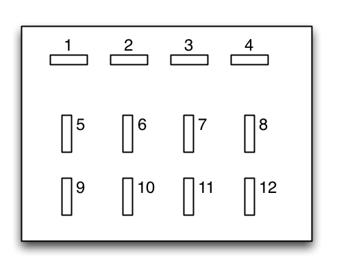

*   1[Pinouts](#Asgecopinouts-Pinouts)
    *   1.1[Protoshield terminal blocks (151B.184.2EL.B)](#Asgecopinouts-Protoshieldterminalblocks(151B.184.2EL.B))
    *   1.2[Protoshield DuPont pinout](#Asgecopinouts-ProtoshieldDuPontpinout)
    *   1.3[CAT5e cable to home](#Asgecopinouts-CAT5ecabletohome)
    *   1.4[Generatore 12pin connector](#Asgecopinouts-Generatore12pinconnector)
    *   1.5[Morsettiera 220V](#Asgecopinouts-Morsettiera220V)
    *   1.6[Current sensor CAT5 cable](#Asgecopinouts-CurrentsensorCAT5cable)

## Pinouts

### Protoshield terminal blocks (151B.184.2EL.B)
| # | Arduino Port | Type | Used for                                                                   |   |   |   |   |   |
|---|--------------|------|----------------------------------------------------------------------------|---|---|---|---|---|
| 1 | D7           | IN   | micro switch to detect diesel valve position                               |   |   |   |   |   |
| 2 | D2           | IN   | on/off auxiliary switch to detect when there was a manual request to start |   |   |   |   |   |
| 3 | A0           | IN   | current sensor to detect when to let go of starter motor                   |   |   |   |   |   |
| 4 | RESET        | IN   | used to reset arduino remotely if necessary                                |   |   |   |   |   |
| 5 | A4           | IN   | OIL sensor                                                                 |   |   |   |   |   |
| 6 | A3           | IN   | used as digital pin to detect when generator is running or not             |   |   |   |   |   |

### Protoshield DuPont pinout

1 = side closest to arduino D0/D1

| # | Arduino Port | Type | Used for                        |   |   |   |   |   |
|---|--------------|------|---------------------------------|---|---|---|---|---|
| 1 | D3           | OUT  | relay board CH8 (starter)       |   |   |   |   |   |
| 2 | A5           | OUT  | relay board CH7                 |   |   |   |   |   |
| 3 | D5           | OUT  | relay board CH6 (RUN solenoid)  |   |   |   |   |   |
| 4 | D6           | OUT  | relay board CH3 (STOP solenoid) |   |   |   |   |   |
| 5 | D8           | OUT  | relay board CH4 (mains relay)   |   |   |   |   |   |
| 6 | D9           | OUT  | relay board CH2                 |   |   |   |   |   |

### CAT5e cable to home

|     |     |     |
| --- | --- | --- |
| 1   | WOR | GND |
| 2   | ORA | on/off auxiliary switch to detect when there was a manual request to start |
| 3   | WGR | 24V from battery bank |
| 4   | BLU | 220V L from generator output pre-main relay for status monitoring |
| 5   | WBL | RESET |
| 6   | GRE | NC  |
| 7   | WBR | NC  |
| 8   | BRN | NC  |

### Generatore 12pin connector

View from male solder side or female connector side.

|     | PIN | note |     | Polarity |
| --- | --- | --- | --- | --- |
|     | PIN | note |     | Polarity |
| --- | --- | --- | --- | --- |
| A1  | 1   | Stop solenoid |     |  |
| A6  | 6   | Stop solenoid |     |  |
| B1  | 7   | Run solenoid |     |  |
| B5  | 11  | Run solenoid |     |  |
| B3  | 9   | 12V Batt |     |  |
| A2  | 2   | 12V Batt |     |  |
| B6  | 12  | Starter |     |  |
| A3  | 3   | Microswitch NO |     |     |
| A4  | 4   | Microswitch COM |     |     |
| A5  | 5   | Charger |     |  |
| B2  | 8   | OIL |     |  |
| B4  | 10  | NC  |     |

### Morsettiera 220V

|     |     |     |
| --- | --- | --- |
| A   | 220V from home L | c-tek battery charger |
| B   | 220V from home N | c-tek battery charger |
| C   | L1 from generator | D8 Mains ?? |
| D   | L1 from generator | mains relay U |
| E   | L2 from generator | mains relay V |
| F   | L3 from generator | mains relay W |
| G   | N from generator |     |
| H   | N from generator | mains relay |
| I   | GND from generator |

### Current sensor CAT5 cable

|     |     |     |
| --- | --- | --- |
| 1   | WOR | Vcc |
| 2   | ORA | Vout |
| 3   | WGR | GND |
| 4   | BLU | NC  |
| 5   | WBL | NC  |
| 6   | GRE | Vsense |
| 7   | WBR | NC  |
| 8   | BRN | NC  |